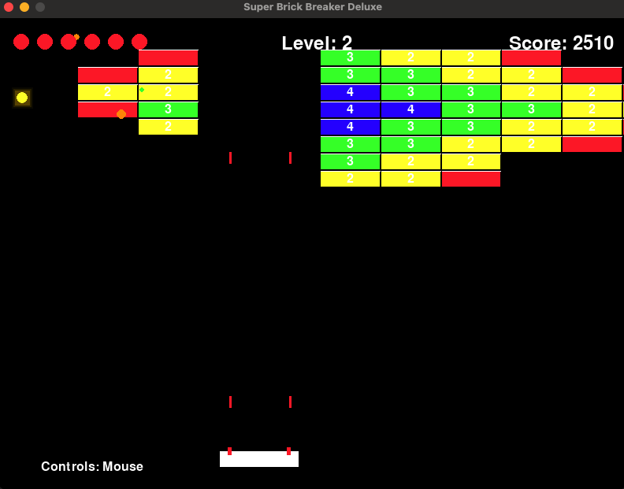

# Super Brick Breaker Deluxe

A feature-rich implementation of the classic Brick Breaker game using Python and Pygame.

## Description

Super Brick Breaker Deluxe is a modern take on the classic arcade game where players control a paddle to bounce a ball and break bricks. This implementation includes multiple powerups, levels with increasing difficulty, special effects, and much more!

## Features

### Multiple Ball Types
- **Normal Ball**: Bounces off bricks and walls
- **Thru-Ball**: Can pass through multiple bricks without bouncing

### Advanced Powerup System
- **Expand Paddle** (Green +): Makes your paddle wider
- **Shrink Paddle** (Red -): Negative powerup that makes your paddle smaller
- **Multi-Ball** (Cyan M): Adds extra balls to the game
- **Slow Ball** (Blue S): Reduces ball speed for easier control
- **Fast Ball** (Orange F): Negative powerup that increases ball speed
- **Laser** (Yellow L): Gives your paddle the ability to shoot lasers
- **Extra Life** (Purple ♥): Gives you an additional life
- **Thru-Ball** (Yellow T): Makes balls pass through bricks without bouncing

### Level Progression
- Multiple unique level layouts that get progressively more challenging
- Bricks with different strength values (1-4 hits required to break)
- Visual indication of brick strength with numbers and colors

### Visual Effects
- Particle effects when bricks break
- Glowing effects for special powerups
- Animated powerups that rotate as they fall

### Game Mechanics
- Paddle physics that angles the ball based on where it hits
- Lasers that can destroy bricks from a distance
- Lives system with visual indicators
- Score tracking and high score saving

### User Experience
- Mouse or keyboard controls (toggle with M key)
- Pause functionality (P key)
- Level transition screens
- Game over screen with high score tracking

## Controls
- **Mouse Movement**: Move the paddle left and right
- **Left/Right Arrow Keys**: Alternative paddle control
- **Space Bar**: Launch ball / Start level
- **M Key**: Toggle between mouse and keyboard controls
- **P Key**: Pause game
- **R Key**: Reset (when all balls are lost)
- **Esc Key**: Quit game

## Requirements
- Python 3.x
- Pygame library

## Installation
1. Make sure you have Python installed on your system.
2. Install the Pygame library:
pip install pygame
3. Clone this repository or download the source code.
4. Run the game:
python brick_breaker.py

## Optional: Adding Sound Files
The game looks for the following sound files (not included):
- bounce.wav - Ball bouncing off walls/paddle
- brick.wav - Ball hitting bricks
- powerup.wav - Collecting powerups
- life_lost.wav - Losing a life
- level_complete.wav - Completing a level

If these files aren't present, the game will still run without sound.

## Screenshot

## License
This project is open source and available under the MIT License.

## Credits
Created using Python and Pygame.
